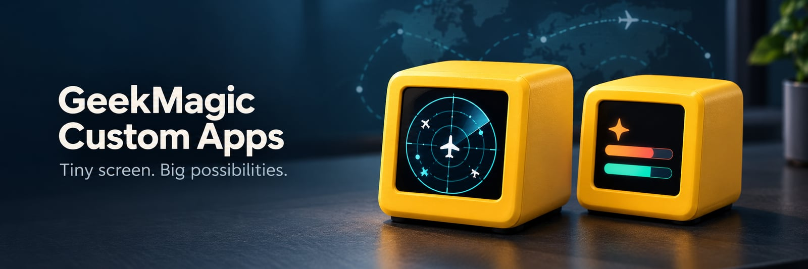

# geekmagic-custom-apps

Render small information screens and push them to a **stock GeekMagic SmallTV display** over its
own HTTP API. No Home Assistant, no ESPHome, no custom firmware, and nothing installed
on the display itself.

```
module data  →  normalized frame  →  SVG  →  480×480 raster  →  240×240 JPEG  →  HTTP upload
```

The display is an image sink; modules never run on it. A frame whose bytes are unchanged
is never re-sent.

Two modules ship in this release:

- **Claude Usage** — Claude Code subscription rate limits from your local session, or
  Anthropic organization API tokens and cost.
- **ADS-B Monitor** — the nearest or currently overhead aircraft around a location you
  configure, with distance, altitude, speed, bearing, and the operator and route behind
  the callsign.

| ADS-B Monitor                                                       | Claude Usage                                                               |
| ------------------------------------------------------------------- | -------------------------------------------------------------------------- |
|  |  |

A SmallTV-PRO on stock firmware `V3.4.88EN`, driven entirely over its own HTTP API.

---

## Device support — read this first

> [!IMPORTANT]
> **Only the GeekMagic SmallTV-PRO has been tested against real hardware**, on firmware
> `V3.4.88EN`. Support for every other device is written from documented endpoints and
> verified against a firmware simulator in CI — **we have not been able to confirm it on
> a physical unit**.

| Profile                | Device                                 | Hardware-verified               |
| ---------------------- | -------------------------------------- | ------------------------------- |
| `stock-pro`            | SmallTV-PRO, stock firmware            | **Yes** — `V3.4.88EN`           |
| `stock-ultra`          | SmallTV Ultra, stock firmware          | No — untested on hardware       |
| `sd-pro`               | Ultra-branded units on SD_PRO firmware | No — untested on hardware       |
| `weather-clock-legacy` | Legacy weather clock                   | No — detected, never written to |
| `unknown`              | Anything else                          | All write actions disabled      |

Firmware is detected before anything is written, and an unrecognised display receives no
write requests at all — so the realistic failure mode on an untested unit is an error in
the UI, not a damaged display. If you own one, the Diagnostics page produces a report
(no hostnames, no coordinates) that is enough to confirm or fix an adapter. Those reports
are very welcome.

Details, endpoints and verification status: [docs/DEVICES.md](docs/DEVICES.md).

---

## Requirements

- **macOS or Linux.** Windows is untested; WSL2 is the likely route, or Docker.
- **Node.js 22.11 or newer**, and **pnpm 10** (`corepack enable` provides it).
  `better-sqlite3` ships prebuilt binaries for common platforms; elsewhere it compiles,
  which needs Python 3 and a C++ toolchain.
- **A GeekMagic display on your Wi-Fi.** Set it up with the vendor's instructions
  first. It shows its IP address on screen once connected — note it down, you will
  type it in during setup. Give it a DHCP reservation in your router so it keeps it.

Prefer containers? Skip to [Docker](#docker).

## Quick start

```bash
git clone https://github.com/ssafayet/geekmagic-smalltv-custom-apps.git
cd geekmagic-smalltv-custom-apps
corepack enable
pnpm install
pnpm build
pnpm start
```

Open <http://localhost:3210>. The setup wizard asks for the display's IP, sends it a test
frame, and lets you turn modules on. Nothing else needs configuring: the server binds
to `127.0.0.1`, needs no account, and stores everything locally.

To change a default, `cp .env.example .env` and uncomment the line; `pnpm start` reads
it. To use the UI from your phone or another computer, set `GCA_HOST=0.0.0.0`: the log
then prints a one-time setup code, which you enter in the browser to choose a password.
See [DEPLOYMENT.md](docs/DEPLOYMENT.md#using-it-from-your-phone-or-another-computer-on-the-lan).

> On a SmallTV-PRO, picture mode is a slideshow, so a deterministic dashboard requires
> the managed image to be the only picture in the album. The UI shows you the exact list
> of pictures first, backs every one up with a checksum, and deletes nothing until the
> new image is confirmed on the device. One step stays manual: open the Picture app once
> on the device itself. See [docs/DEVICES.md](docs/DEVICES.md#stock-pro).

To keep it running across reboots, see [launchd and systemd](docs/DEPLOYMENT.md#native).

### Docker

```bash
docker compose up -d --build
```

Open <http://localhost:3210>. Works as-is on Docker Desktop, OrbStack and Linux;
`.env` is optional and read automatically. Two things differ from a native install:

- **Enter the display's IP by hand.** The container sees Docker's network, not your
  LAN, so the subnet scan cannot find it. On Linux,
  [host networking](docs/DEPLOYMENT.md#docker) lets the scan work.
- **Claude Usage needs the bridge** on the host, because the container cannot see your
  Claude Code. Set the same `GCA_BRIDGE_TOKEN` in `.env` for both sides; see
  [CLAUDE-BRIDGE.md](docs/CLAUDE-BRIDGE.md#docker).

## Turning on the modules

You need neither module to use the other. Each is enabled from the **Modules** page and
placed on the display from **Display order**.

**ADS-B Monitor** needs only a location. It defaults to the free
[adsb.fi](https://github.com/adsbfi/opendata) community feed with no account; switch to
OpenSky Network in settings if volunteer coverage near you is thin. Your coordinates are
sent to the provider on every poll — the settings page says so, and they are rounded
before they reach any log. Airline and route are not broadcast by aircraft; they are
looked up from the callsign against [adsbdb](https://www.adsbdb.com/), cached, and can
be switched off.

**Claude Usage** works without setup when the server runs as you on the same machine as
a signed-in Claude Code: it reads your 5-hour and 7-day limits from the CLI every few
minutes. For live updates after every request, or when the server runs in Docker,
install the status-line bridge:

```bash
pnpm bridge:install
```

Your existing status line keeps working and is restored byte-for-byte by
`pnpm bridge:uninstall`; no credentials are read and no prompt content is collected.
`pnpm bridge:doctor` explains anything that is not arriving.

Both are documented in [docs/BUILT-IN-MODULES.md](docs/BUILT-IN-MODULES.md).

### When the display shows nothing

1. **Devices** page: is the display online, and does **Send test frame** reach it?
2. **Display order**: is at least one module view in the rotation?
3. **SmallTV-PRO**: was the album taken over, and was the Picture app opened once on
   the device? See [DEVICES.md](docs/DEVICES.md#stock-pro).
4. **Overview**: any problem listed there names its cause.

More in [DEPLOYMENT.md](docs/DEPLOYMENT.md#troubleshooting).

---

## Security and privacy

Loopback by default; binding anywhere else requires an administrator password, and the
first one can only be set with a code from the server log. The server answers only to
local hostnames, which blocks DNS-rebinding attacks from web pages you visit. Device
requests are treated as an SSRF boundary. Secrets are encrypted at rest under a master
key kept outside the database, and a stored secret is never returned to the browser. No
analytics, no telemetry, no cloud account.

Full threat model: [docs/SECURITY.md](docs/SECURITY.md).

---

## Documentation

| Document                                        | Contents                                            |
| ----------------------------------------------- | --------------------------------------------------- |
| [ARCHITECTURE.md](docs/ARCHITECTURE.md)         | Package layout, data flow, scheduling model         |
| [BUILT-IN-MODULES.md](docs/BUILT-IN-MODULES.md) | Claude Usage and ADS-B Monitor in detail            |
| [DEVICES.md](docs/DEVICES.md)                   | Firmware profiles, endpoints, adding an adapter     |
| [CLAUDE-BRIDGE.md](docs/CLAUDE-BRIDGE.md)       | Bridge internals, install and recovery              |
| [MODULES.md](docs/MODULES.md)                   | Writing your own module against the SDK             |
| [DEPLOYMENT.md](docs/DEPLOYMENT.md)             | launchd, systemd, Docker, reverse proxies, env vars |
| [SECURITY.md](docs/SECURITY.md)                 | Threat model and controls                           |
| [DEVELOPMENT.md](docs/DEVELOPMENT.md)           | Local setup, tests, working without hardware        |

## Contributing

```bash
pnpm typecheck && pnpm test
```

Rendering and device behaviour are both verifiable without hardware — see
[docs/DEVELOPMENT.md](docs/DEVELOPMENT.md). Adapter reports from untested devices are the
single most useful contribution right now.

## Forgotten password

```bash
pnpm auth:reset       # Docker: docker compose exec geekmagic-custom-apps node dist/cli/reset-password.js
```

It prints a new setup code; restart the server and choose a new password in the UI.

## Licence

MIT. Device protocol behaviour was derived from the MIT-licensed
[adrienbrault/geekmagic-hacs](https://github.com/adrienbrault/geekmagic-hacs); bundled
fonts are under the SIL Open Font License. See [LICENSE](LICENSE).

This is an independent project. It is not affiliated with or endorsed by GeekMagic or
Anthropic; product names are used only to say what it works with.
