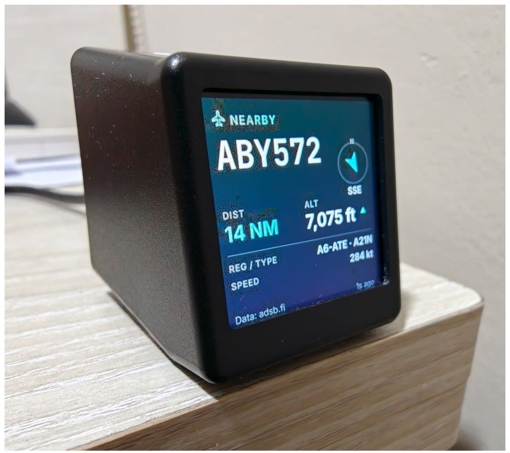
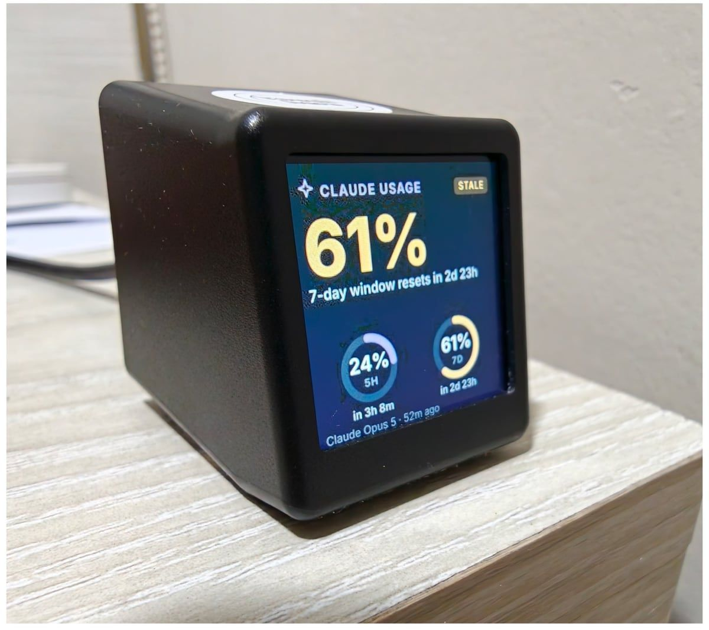

# geekmagic-custom-apps

Render small information screens and push them to a **stock GeekMagic SmallTV display** over its
own HTTP API. No Home Assistant, no ESPHome, no custom firmware, and nothing installed
on the display itself.

```
module data  →  normalized frame  →  SVG  →  480×480 raster  →  240×240 JPEG  →  HTTP upload
```

The display is an image sink; modules never run on it. A frame whose bytes are unchanged
is never re-sent.

Two modules ship in this release:

- **Claude Usage** — Claude Code subscription rate limits from your local session, or
  Anthropic organization API tokens and cost.
- **ADS-B Monitor** — the nearest or currently overhead aircraft around a location you
  configure, with distance, altitude, speed, bearing, and the operator and route behind
  the callsign.

| ADS-B Monitor                                                       | Claude Usage                                                               |
| ------------------------------------------------------------------- | -------------------------------------------------------------------------- |
|  |  |

A SmallTV-PRO on stock firmware `V3.4.88EN`, driven entirely over its own HTTP API.

---

## Device support — read this first

> [!IMPORTANT]
> **Only the GeekMagic SmallTV-PRO has been tested against real hardware**, on firmware
> `V3.4.88EN`. Support for every other device is written from documented endpoints and
> verified against a firmware simulator in CI — **we have not been able to confirm it on
> a physical unit**.

| Profile                | Device                                 | Hardware-verified               |
| ---------------------- | -------------------------------------- | ------------------------------- |
| `stock-pro`            | SmallTV-PRO, stock firmware            | **Yes** — `V3.4.88EN`           |
| `stock-ultra`          | SmallTV Ultra, stock firmware          | No — untested on hardware       |
| `sd-pro`               | Ultra-branded units on SD_PRO firmware | No — untested on hardware       |
| `weather-clock-legacy` | Legacy weather clock                   | No — detected, never written to |
| `unknown`              | Anything else                          | All write actions disabled      |

Firmware is detected before anything is written, and an unrecognised display receives no
write requests at all — so the realistic failure mode on an untested unit is an error in
the UI, not a damaged display. If you own one, the Diagnostics page produces a report
(no hostnames, no coordinates) that is enough to confirm or fix an adapter. Those reports
are very welcome.

Details, endpoints and verification status: [docs/DEVICES.md](docs/DEVICES.md).

---

## Requirements

- Node.js 22.11 or newer
- pnpm 10
- A GeekMagic display on the same network

## Quick start

```bash
pnpm install
pnpm build
pnpm start
```

Open <http://localhost:3210>. The first run walks you through adding a display, sending a
test frame, and enabling modules.

That is the whole setup. The server binds to `127.0.0.1`, needs no account, and stores
everything locally.

> On a SmallTV-PRO, picture mode is a slideshow, so a deterministic dashboard requires
> the managed image to be the only picture in the album. The UI shows you the exact list
> of pictures first, backs every one up with a checksum, and deletes nothing until the
> new image is confirmed on the device. One step stays manual: open the Picture app once
> on the device itself. See [docs/DEVICES.md](docs/DEVICES.md#stock-pro).

### Docker

```bash
docker compose --env-file .env -f docker/compose.yaml up -d
```

`--env-file .env` is not optional. Compose resolves `.env` relative to the compose
file, so `docker/.env` — without the flag, everything you set in the repo root `.env`
is silently dropped. Check with
`docker compose --env-file .env -f docker/compose.yaml config`.

The container needs routing to your display's LAN, and Claude Code detection does not
work from inside it — install the bridge on the host instead, with the same
`GCA_BRIDGE_TOKEN` the container got. See [docs/DEPLOYMENT.md](docs/DEPLOYMENT.md).

## Turning on the modules

**Claude Usage** needs the status-line bridge, because Claude Code runs as you and a
background service cannot see your installation:

```bash
pnpm bridge:install
```

Your existing status line keeps working and is restored byte-for-byte on uninstall; no
credentials are read and no prompt content is collected. Usage appears after Claude Code
makes its next request.

**ADS-B Monitor** needs a location. It defaults to the free
[adsb.fi](https://github.com/adsbfi/opendata) community feed with no account; switch to
OpenSky Network in settings if volunteer coverage near you is thin. Your coordinates are
sent to the provider on every poll — the settings page says so, and they are rounded
before they reach any log. Airline and route are not broadcast by aircraft; they are
looked up from the callsign against [adsbdb](https://www.adsbdb.com/), cached, and can
be switched off.

Both are documented in [docs/BUILT-IN-MODULES.md](docs/BUILT-IN-MODULES.md).

---

## Security and privacy

Loopback by default; binding anywhere else requires an administrator password. Device
requests are treated as an SSRF boundary. Secrets are encrypted at rest under a master
key kept outside the database, and a stored secret is never returned to the browser. No
analytics, no telemetry, no cloud account.

Full threat model: [docs/SECURITY.md](docs/SECURITY.md).

---

## Documentation

| Document                                        | Contents                                            |
| ----------------------------------------------- | --------------------------------------------------- |
| [ARCHITECTURE.md](docs/ARCHITECTURE.md)         | Package layout, data flow, scheduling model         |
| [BUILT-IN-MODULES.md](docs/BUILT-IN-MODULES.md) | Claude Usage and ADS-B Monitor in detail            |
| [DEVICES.md](docs/DEVICES.md)                   | Firmware profiles, endpoints, adding an adapter     |
| [CLAUDE-BRIDGE.md](docs/CLAUDE-BRIDGE.md)       | Bridge internals, install and recovery              |
| [MODULES.md](docs/MODULES.md)                   | Writing your own module against the SDK             |
| [DEPLOYMENT.md](docs/DEPLOYMENT.md)             | launchd, systemd, Docker, reverse proxies, env vars |
| [SECURITY.md](docs/SECURITY.md)                 | Threat model and controls                           |
| [DEVELOPMENT.md](docs/DEVELOPMENT.md)           | Local setup, tests, working without hardware        |

## Contributing

```bash
pnpm typecheck && pnpm test
```

Rendering and device behaviour are both verifiable without hardware — see
[docs/DEVELOPMENT.md](docs/DEVELOPMENT.md). Adapter reports from untested devices are the
single most useful contribution right now.

## Licence

MIT. Device protocol behaviour was derived from the MIT-licensed
[adrienbrault/geekmagic-hacs](https://github.com/adrienbrault/geekmagic-hacs); bundled
fonts are under the SIL Open Font License. See [LICENSE](LICENSE).
