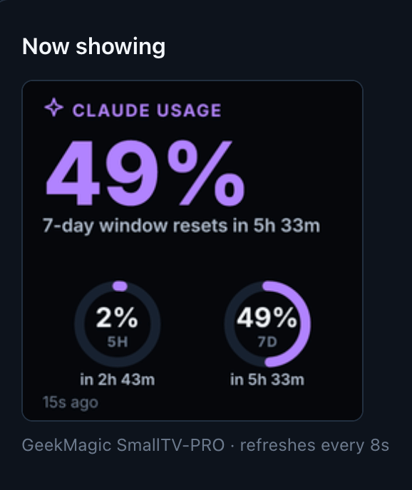
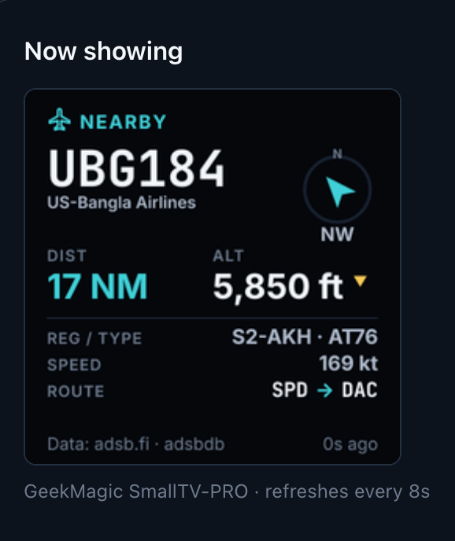

# Built-in modules

Two modules ship in this release. Both are ordinary `AppModule` implementations with
no privileged access to the server — see [MODULES.md](MODULES.md) for the contract they
are written against.

---

## Claude Usage

| Overview page                                                                 | On the display                                                        |
| ----------------------------------------------------------------------------- | --------------------------------------------------------------------- |
|  |  |

The `stale` badge on the right is the module refusing to imply freshness it does not
have: past **Mark data stale after** (30 minutes by default) the last real reading stays
on screen with the badge, rather than blanking or falling back to zero.

Subscription usage and API usage are **different products**, and this module keeps them
clearly separated rather than blending them into one number.

| Source                     | What you need                                                                                  | What you see                                      |
| -------------------------- | ---------------------------------------------------------------------------------------------- | ------------------------------------------------- |
| Local Claude Code          | A signed-in Claude Code on the same machine; the status-line bridge for live updates or Docker | 5-hour and 7-day used percentage, and reset times |
| Anthropic organization API | A credential authorized for usage reporting                                                    | Tokens, requests and cost over a window you pick  |

The **Source** setting is `Auto`, `Local Claude Code`, or `Organization usage API`.
`Auto` prefers the local bridge and can optionally fall back to the API credential when
Claude Code has been quiet.

### Why your API key may not work

An ordinary API key that can call Claude is usually **not** authorized for organization
usage reporting; those are separate scopes. The UI says so precisely — including which
check failed — rather than reporting a vague error. Use the **Test credential** action
on the settings page to confirm before relying on it.

### The status-line bridge

When the server runs as you, it reads the limits from the Claude Code CLI every few
minutes with no setup at all. The status-line bridge makes them live — forwarded on
every request — and is the only route when the server runs in Docker or under another
account, since those cannot see your Claude Code. Install it with:

```bash
pnpm bridge:install
```

Its guarantees in brief — your existing status line keeps working and is restored
byte-for-byte on uninstall, no credentials are ever read, no prompt content is
collected, and it never breaks Claude Code even when the server is down. The full
design, the exact payload fields, and recovery steps are in
[CLAUDE-BRIDGE.md](CLAUDE-BRIDGE.md).

Usage appears after Claude Code makes its next request. Until then the display honestly
says _waiting_, never zero.

---

## ADS-B Monitor

| Overview page                                                                  | On the display                                                 |
| ------------------------------------------------------------------------------ | -------------------------------------------------------------- |
|  |  |

The header reads `NEARBY` or `OVERHEAD`. Operator and route come from a second source,
so they appear only when the callsign resolved, and the footer credits `adsbdb` only on the
frames that actually used it — which is why the photo credits `adsb.fi` alone.

Shows the nearest or currently overhead aircraft around a location you configure, with
distance, altitude, speed and bearing.

### Providers

The provider sits behind an interface, so a local `readsb` receiver or a licensed feed
can be added later without touching selection or rendering.

The module runs as a single instance. The provider is a setting inside it, not a reason
to add the module twice.

| Provider                                                         | Account  | Constraint                                                                     | Carries registration and type |
| ---------------------------------------------------------------- | -------- | ------------------------------------------------------------------------------ | ----------------------------- |
| [adsb.fi](https://github.com/adsbfi/opendata) (default)          | None     | Roughly one request per second; coverage depends on volunteer feeders near you | Yes                           |
| [OpenSky Network](https://openskynetwork.github.io/opensky-api/) | Optional | A **daily** request budget, not a per-second rate limit                        | No                            |

Pick adsb.fi first. It is free, needs no account, and returns richer data. Switch to
OpenSky when volunteer coverage near you is thin — in parts of South Asia, for example,
adsb.fi returns nothing where OpenSky returns traffic.

**OpenSky's budget is the binding constraint.** It bills per request and resets daily,
so the poll interval — not a rate limit — decides whether a deployment runs out by
lunchtime:

| Credentials          | Daily requests | Slowest safe poll |
| -------------------- | -------------- | ----------------- |
| Anonymous            | ~400           | ~238 s            |
| Client ID and secret | ~4,000         | ~24 s             |

Settings validation refuses a poll interval that would exhaust the budget, and says why,
instead of letting the module fail silently halfway through the day. Credentials are
optional, stored in the encrypted vault like any other module secret, and entered as
`openSkyClientId` / `openSkyClientSecret` on the settings page.

OpenSky state vectors carry no registration or aircraft type, so those fields stay
absent rather than being guessed. The settings page warns about this before you switch.

### Airline and route

An aircraft broadcasts a callsign. It does not broadcast who operates it or where it is
going, so neither adsb.fi nor OpenSky can return those. The **Airline and route** switch
(on by default) resolves them from the callsign against
[adsbdb](https://www.adsbdb.com/), which needs no account, and the panel then shows the
operator under the callsign and `LHR → JFK` under the speed.

It resolves for scheduled airline traffic and not for general aviation, which has no
published schedule — `N172SP` has no route and never will. A callsign with no answer
simply shows nothing, the same as a missing altitude.

Lookups are kept cheap on purpose, because the API is free and shared:

- Only the aircraft actually on screen are looked up, never the whole sky.
- At most three new callsigns per poll.
- Answers are cached for a day, and a "no route" answer for six hours, so a flight
  circling overhead costs one request rather than one per poll.
- The cache survives a restart, and a rate-limit response pauses lookups for five
  minutes rather than retrying into it.

Turn the switch off and the panel shows only what the aircraft itself transmits.

### Behaviour

- **Overhead uses hysteresis.** An aircraft becomes overhead at the enter radius and
  stays overhead until it passes the larger exit radius, so one drifting along the
  boundary cannot flap the display back and forth.
- **Absent data stays absent.** A missing altitude renders as `—`, never `0 ft`.
- **An empty sky is healthy**, not an error. The **Test location** action distinguishes
  "the provider worked and there is nothing up there" from "the provider failed".
- **Overhead traffic can interrupt the playlist**, subject to a per-device cooldown.
  See [ARCHITECTURE.md](ARCHITECTURE.md#attention-interruption).
- **Nothing is invented.** Airline and route are not in the broadcast, so they are
  either resolved from a named second source or left off the panel. Neither is ever
  guessed from the callsign prefix.

### Privacy

Your coordinates are sent to the provider on every poll. The settings page says so at
the point of entry, the values are stored locally, and they are rounded before they
reach any log or diagnostics export. See
[SECURITY.md](SECURITY.md#location-privacy).

With **Airline and route** on, the callsign of each aircraft being displayed is also
sent to `api.adsbdb.com`. That is the whole request: no coordinates, no device identity,
nothing that ties the callsign to you beyond the network connection itself. A callsign
is public information already broadcast in the clear by the aircraft. Turn the switch
off to keep every outbound request going to the ADS-B provider alone.
